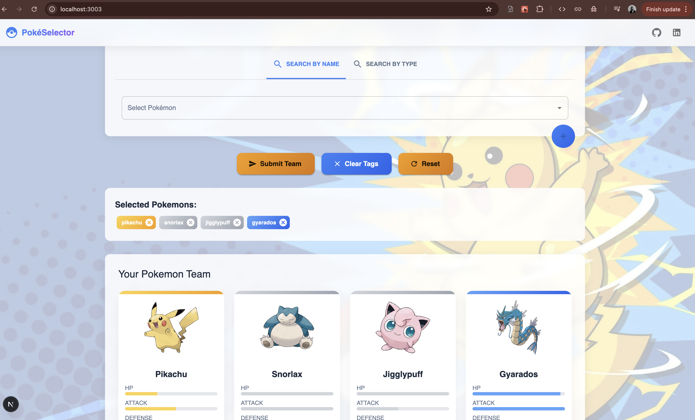

# Sigma Pokémon Selector

A modern web application for selecting and managing your favorite Pokémon team. Built with Next.js, TypeScript, and Material UI.



## Project Overview

Sigma Pokémon Selector is an interactive web application that allows users to search for Pokémon by name or type, add them to their team, and view detailed information about each selected Pokémon. The application features a beautiful UI with animations, responsive design, and a seamless user experience.

## Features

- **Search Pokémon**: Search for Pokémon by name or filter by type
- **Build Your Team**: Add Pokémon to your team with a simple click
- **Detailed Information**: View comprehensive details about each Pokémon including:
  - Type(s)
  - Height and weight
  - Abilities
  - Base stats
- **Responsive Design**: Works seamlessly on desktop, tablet, and mobile devices
- **Modern UI**: Beautiful interface with animations and transitions
- **Pagination**: Navigate through your selected Pokémon team

## Technical Stack

- **Frontend Framework**: Next.js 14 with App Router
- **Language**: TypeScript
- **UI Library**: Material UI (MUI)
- **Styling**: Emotion (CSS-in-JS)
- **Animations**: Framer Motion
- **API Integration**: PokeAPI
- **State Management**: React Hooks
- **Code Quality**: ESLint, Prettier

## Application Flow

1. **User Entry**:
   - User arrives at the application homepage
   - They can choose between searching by name or by type

2. **Search Process**:
   - **Name Search**: User types a Pokémon name in the autocomplete field
   - **Type Search**: User selects a Pokémon type from the dropdown
   - The application fetches data from the PokeAPI based on the search criteria

3. **Team Building**:
   - User adds Pokémon to their team using the "Add" button
   - Selected Pokémon appear as chips in the "Selected Pokémons" section
   - User can remove Pokémon from their team by clicking the delete icon on the chip

4. **Team Submission**:
   - User clicks the "Submit Team" button to finalize their selection
   - The application displays the selected Pokémon in a paginated grid view
   - Each Pokémon card shows detailed information including type, stats, and abilities

5. **Team Management**:
   - User can clear all tags using the "Clear Tags" button
   - User can reset the entire selection using the "Reset" button
   - User can navigate through their team using pagination controls

## Setup and Installation

### Prerequisites

- Node.js (v18 or higher)
- npm or yarn

### Installation Steps

1. Clone the repository:
   ```bash
   git clone https://github.com/yourusername/sigma-poke-selector.git
   cd sigma-poke-selector
   ```

2. Install dependencies:
   ```bash
   npm install
   # or
   yarn install
   ```

3. Set up environment variables:
   ```bash
   cp .env.example .env
   ```
   Edit the `.env` file with your configuration.

4. Run the development server:
   ```bash
   npm run dev
   # or
   yarn dev
   ```

5. Open [http://localhost:3000](http://localhost:3000) in your browser to see the application.

## Project Structure

```
sigma-poke-selector/
├── public/              # Static assets
├── src/
│   ├── app/             # Next.js App Router
│   │   ├── _components/ # Reusable components
│   │   ├── page.tsx     # Home page
│   │   └── pokemon/     # Pokémon-related pages
│   ├── lib/             # Utility functions and API clients
│   └── types/           # TypeScript type definitions
├── .env                 # Environment variables
├── .env.example         # Example environment variables
├── next.config.js       # Next.js configuration
├── package.json         # Project dependencies
└── tsconfig.json        # TypeScript configuration
```

## API Integration

The application integrates with the [PokeAPI](https://pokeapi.co/) to fetch Pokémon data. The following endpoints are used:

- `/api/v2/pokemon/{name}`: Fetch Pokémon details by name
- `/api/v2/type/{type}`: Fetch Pokémon by type

## Future Enhancements

- User authentication and saved teams
- Team recommendations based on type coverage
- Battle simulation between teams
- Social sharing of teams
- Dark mode support

## Contributing

Contributions are welcome! Please feel free to submit a Pull Request.

## License

This project is licensed under the MIT License - see the LICENSE file for details.

## Acknowledgments

- [PokeAPI](https://pokeapi.co/) for providing the Pokémon data
- [Next.js](https://nextjs.org/) for the amazing React framework
- [Material UI](https://mui.com/) for the beautiful UI components
- [Framer Motion](https://www.framer.com/motion/) for the animations
